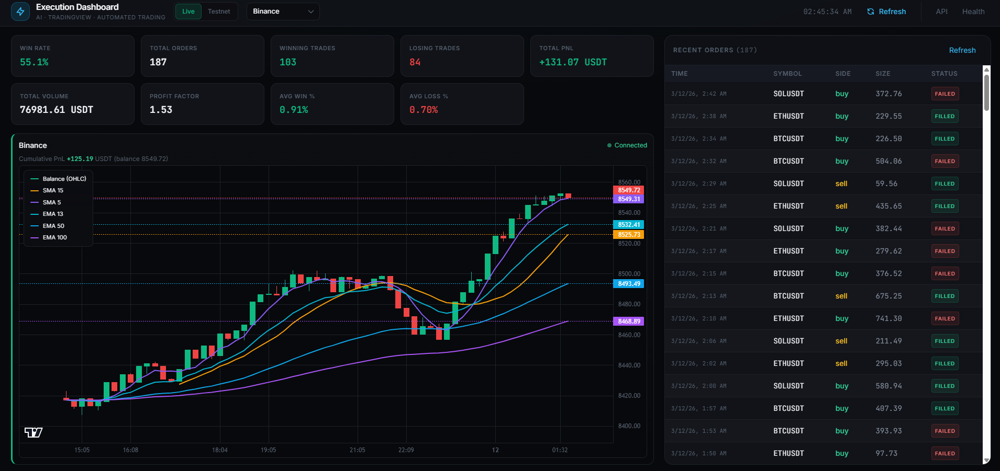
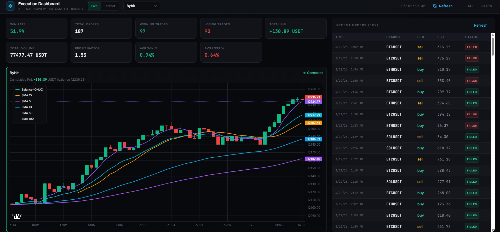
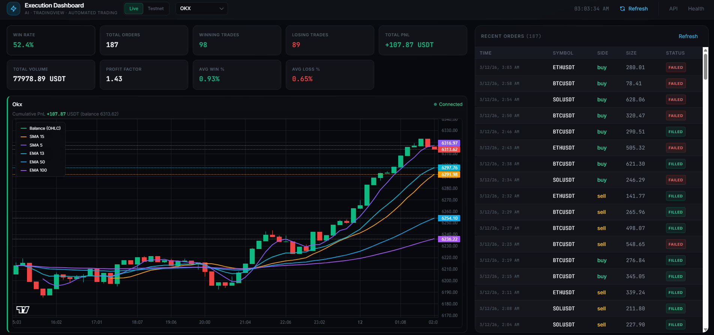
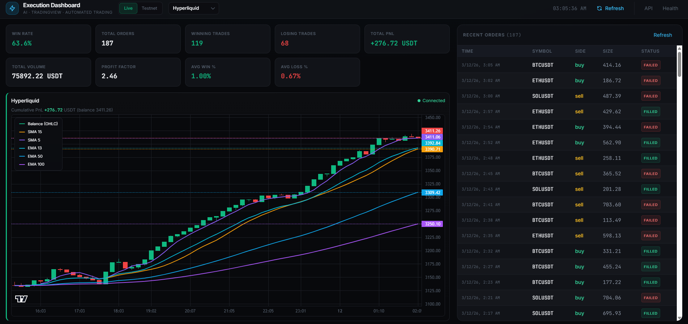

# 📈 TradingView Webhook Bot – Auto Execute Crypto Strategies

> **For traders:** Keep your edge on the chart. Execute on exchange in seconds—with risk limits, TP/SL, and optional AI. No coding required once it’s set up.

[](https://t.me/galileo0000)

I have years of real trading experience building and running automation like this in live markets, so if you want help tailoring the bot to your strategy and improving your results, feel free to contact me on Telegram any time.

---

## 🎯 One Alert → Four Exchanges

Your TradingView setup stays the same. When your alert fires, this bot places the trade on **Binance**, **Bybit**, **OKX**, or **Hyperliquid**—with size and risk under your control.

*With consistent execution and risk controls, the bot can target **stable daily profit in the 0.7–3.6%** range (results depend on your strategy, market conditions, and risk settings).*

### Dashboard

The **dashboard** (`GET /dashboard`) shows exchange status, USDT balance, daily PnL, recent orders, metrics, and a Live/Testnet switch. It auto-refreshes every 30 seconds.

#### Screenshots

| | |
|---|---|
|  |  |
| *Screenshot 0* | *Screenshot 1* |
|  |  |
| *Screenshot 2* | *Screenshot 3* |

Add your own files: `images/Screenshot_0.png` … `Screenshot_3.png`.

#### Demo video

<video src="videos/video_0.mp4" controls width="640" style="max-width:100%; border-radius:8px; border:1px solid #1e2128;"></video>

*[Open or download video](videos/video_0.mp4) if the player above is not supported.*

Add your demo: `videos/video_0.mp4`.

---

## 💹 Execute Fast. Risk Under Control.

Traders get speed without giving up control: max size, daily loss limit, symbol allowlist, and optional LLM review before every order.

---

## 🔗 One Alert. Four Exchanges.

Point your webhook here once. Choose the exchange (and symbol/size/TP/SL) in the alert message. Same strategy, any of these venues.

---

## 📐 Trading Strategy: How the Bot Executes (and Where Yours Lives)

The bot **does not choose when or what to trade**. Your strategy—entries, exits, indicators—lives in **TradingView**. The bot’s job is to **execute** your alert on exchange **safely**: same idea, risk limits, TP/SL, and optional AI in the loop.

### Where the “strategy” is

- **Signal source:** A TradingView alert fires and sends a JSON message to `POST /webhook` with `exchange`, `symbol`, `side`, `size_usdt`, optional `leverage`, `take_profit`, `stop_loss`, `trailing_stop`, etc. You design the condition (e.g. RSI cross, level break) in TradingView; the alert just passes the chosen parameters.
- **Optional AI signals:** You can instead call `POST /signals/generate` (with optional `execute=true`) so an LLM suggests buy/sell/hold and size from market context; execution then uses the **same pipeline** below. So “strategy” can be: (1) only TradingView, (2) only AI signals, or (3) TradingView + AI enhancer/advisor.

### Execution pipeline (every order)

For each webhook (or executed signal), the bot runs this sequence **in order**:

1. **Auth & idempotency** – Check webhook secret (if required). If `request_id` was already seen within the idempotency window, respond “duplicate” and **do not trade**.
2. **AI enhancer (optional)** – If enabled, the LLM can allow, reject, or **adjust** the payload (e.g. reduce `size_usdt`, add `stop_loss`) before any risk or execution. Rejected alerts never reach the exchange.
3. **Risk checks** – All of the following are applied in a fixed order. The first **reject** aborts the order; **caps** (e.g. size/leverage) are applied and execution continues with the adjusted values.
4. **LLM advisor (optional)** – If enabled, the LLM can approve, reject, or **modify** size/leverage/TP/SL one more time. Rejected orders are not sent.
5. **Place order** – Send the (possibly capped/modified) market order to the chosen exchange. Retries with backoff on transient failures.
6. **TP/SL** – If the order filled and `take_profit` and/or `stop_loss` were provided, the bot places the corresponding TP/SL orders on the exchange (all four exchanges supported).
7. **Trailing stop (optional)** – If `trailing_stop` and `trailing_activation_pct` are set, the bot records a pending trailing stop and a background loop will manage moving the stop toward break-even (and beyond) when price moves in your favor by that percentage.

So the **trading strategy** you care about (what to buy/sell and at what size) is entirely in your alert or AI signal; the **execution strategy** of the bot is: enforce risk → optionally ask AI → send one market order → attach TP/SL and optional trailing.

### Risk strategy (checks in order)

Each order is checked in this order. If a check **rejects**, the order is aborted and the webhook returns an error. If a check **caps** (reduces size or leverage), the reduced value is used for the rest of the pipeline and for the actual order.

| Order | Check | Behavior |
|-------|--------|----------|
| 1 | **Symbol allowlist** (`ALLOWED_SYMBOLS`) | Reject if symbol not in list (or allow all if list empty). |
| 2 | **Max position size** (`MAX_POSITION_SIZE_USDT`) | Cap `size_usdt` to this max; never reject for size alone. |
| 3 | **Per-symbol cap** (`MAX_POSITION_PER_SYMBOL_USDT`) | Reject or cap so current exposure + new size does not exceed cap for this symbol. |
| 4 | **Total exposure cap** (`MAX_TOTAL_EXPOSURE_USDT`) | Reject if current total notional + new order would exceed cap. |
| 5 | **Leverage** (`MAX_LEVERAGE`) | Cap leverage to max; never reject for leverage alone. |
| 6 | **Daily loss limit** (`MAX_DAILY_LOSS_USDT`) | Reject if today’s realized PnL (e.g. from closed positions) is already at or past the loss limit. |
| 7 | **Cooldown** | Reject if cooldown is active (e.g. after hitting daily loss limit for `COOLDOWN_AFTER_LOSS_MINUTES`). |
| 8 | **Spread** (`MAX_SPREAD_PCT`) | Reject if orderbook spread (ask−bid)/mid exceeds this (e.g. avoid illiquid moments). Disabled if 0. |

So the bot’s **risk strategy** is: allowlist → cap size → cap per-symbol exposure → cap total exposure → cap leverage → hard stop on daily loss and cooldown → optional spread filter. No order is sent until all of these pass (with caps applied where applicable).

### Live vs testnet

The **Live / Testnet** switch in the dashboard header applies to **all** configured exchanges. In **Live** mode the bot uses each exchange’s mainnet API; in **Testnet** it uses each exchange’s testnet/sandbox (Binance testnet, Bybit testnet, OKX sandbox, Hyperliquid testnet). Switching clears cached API clients so the next request uses the new network. Use testnet and test money first.

---

## 🛡️ Built for Discipline: TP/SL, Limits, Safety

- **TP/SL** – Take-profit and stop-loss on every order (all 4 exchanges).
- **Trailing stop** – Optional break-even trailing after X% profit.
- **Daily loss limit** – Stops new orders when today’s loss hits your cap.
- **Idempotency** – Duplicate alerts don’t double your position.
- **Rate limit & secret** – Only your TradingView (and you) can trigger trades.

---

## ✨ Features at a Glance

| | Feature |
|---|--------|
| 📊 | **Multi-exchange** – Binance, Bybit, OKX, Hyperliquid (futures) |
| 📏 | **Risk checks** – Max position, max leverage, daily loss cap, symbol allowlist, per-symbol cap, total exposure cap, cooldown, max spread |
| 🎯 | **TP/SL** – Take-profit & stop-loss on all supported exchanges |
| 📉 | **Trailing stop** – Break-even activation after X% in your favor |
| 🔒 | **Safety** – Webhook secret, rate limiting, idempotency, retries with backoff |
| 📡 | **Observability** – JSON logging, `/metrics`, `/health`, `/status` |
| 🧪 | **Dry-run** – Test without sending real orders |
| 🤖 | **AI (optional)** – LLM advisor (approve/modify), alert enhancer, AI signal layer |

---

## 🤖 Optional AI Layer

- **LLM advisor** – Every order can be approved, rejected, or adjusted (size/TP/SL) by an LLM before execution.
- **AI enhancer** – Filter or adjust TradingView alerts (e.g. reduce size, add SL) before they hit risk checks.
- **AI signals** – `POST /signals/generate` can produce buy/sell/hold from market context and optionally execute with the same risk pipeline.

---

## 🚀 Quick Start

**Requirements:** Python 3.10+

1. **Install**
   ```bash
   cd ai-automated-trading-bot
   pip install -r requirements.txt
   ```

2. **Configure**
   - Copy `.env.example` to `.env`
   - Add API keys for the exchanges you use
   - Set `WEBHOOK_SECRET` and `REQUIRE_WEBHOOK_SECRET=true` in production
   - Tune risk limits (see Environment Variables below)

3. **Run**
   ```bash
   python main.py
   ```
   Server: `http://0.0.0.0:8000` → Webhook: `POST /webhook`

4. **TradingView alert** – Send a JSON body to `POST /webhook`. Required: `secret`, `exchange`, `symbol`, `side`, `size_usdt`. Optional: `leverage`, `take_profit`, `stop_loss`, `trailing_stop`, `trailing_activation_pct`, `request_id`. Example:
   ```json
   {
     "secret": "your_webhook_secret_here",
     "exchange": "binance",
     "symbol": "BTCUSDT",
     "side": "buy",
     "size_usdt": 100,
     "leverage": 5,
     "take_profit": 50000,
     "stop_loss": 45000,
     "trailing_stop": true,
     "trailing_activation_pct": 2,
     "request_id": "alert-123"
   }
   ```
   Use `request_id` (e.g. alert id) to avoid duplicate orders when the same alert fires twice. If `REQUIRE_WEBHOOK_SECRET` is false, you can send `"secret": ""`.

---

## 📁 Project structure

| Path | Purpose |
|------|---------|
| `main.py` | Entrypoint; runs uvicorn with `server:app`. |
| `server.py` | FastAPI app: webhook, signals, health, metrics, status, dashboard, balance, exchange status, network switch. |
| `config.py` | Pydantic settings from env (`.env`). |
| `models.py` | `WebhookPayload`, `Side`, `ExchangeName`. |
| `risk.py` | Risk checks (allowlist, size, per-symbol/total exposure, leverage, daily loss, cooldown, spread). |
| `db.py` | SQLite: idempotency, order history, risk state. |
| `tpsl.py` | Take-profit/stop-loss placement after order. |
| `trailing_stop.py` | Trailing-stop pending list and background loop. |
| `exchanges/` | `base.py`, `registry.py`, `binance.py`, `bybit.py`, `okx.py`, `hyperliquid.py` (CCXT or native). |
| `ai/` | `llm.py` (OpenAI-compatible), `enhancer.py`, `advisor.py`, `signals.py`. |
| `static/dashboard.html` | Single-page dashboard (Tailwind, Lightweight Charts). |

---

## 📡 API & Dashboard

| Endpoint | Description |
|----------|-------------|
| `GET /` | Redirects to `/dashboard`. |
| `GET /dashboard` | **Dashboard**: exchange status, USDT balance, daily PnL, recent orders, metrics, Live/Testnet switch. Auto-refresh every 30s. |
| `POST /webhook` | TradingView webhook; optional AI enhancer + advisor, then risk + execution. |
| `POST /signals/generate` | AI signal (buy/sell/hold); optional `execute=true` for same risk + execution as webhook. |
| `GET /health` | Liveness. |
| `GET /health/exchanges` | Per-exchange connectivity (balance/read check). |
| `GET /exchanges/status` | Which exchanges are connected (allowed to receive orders). |
| `PUT /exchanges/status` | Set connect/disconnect per exchange. Body: `{"binance": true, "bybit": false, ...}`. |
| `GET /balance` | USDT balance per exchange (from `fetch_balance`). `null` if exchange disconnected or unavailable. |
| `GET /metrics` | Counters: webhooks received/duplicate/rate-limited/auth failed/risk rejected, orders placed/failed/dry_run, tpsl_placed/failed, errors. |
| `GET /status` | Recent orders, daily PnL by exchange, cooldown, dry_run, use_testnet. |
| `PUT /settings/network` | Switch all exchanges between live and testnet. Body: `{"use_testnet": true \| false}`. Clears cached API clients. |

---

## ⚙️ Environment Variables

Copy `.env.example` to `.env` and fill in your values. All variables are optional except those needed for the features you use.

| Variable | Description |
|----------|-------------|
| **Webhook** | |
| `WEBHOOK_SECRET` | Must match `secret` in webhook body when `REQUIRE_WEBHOOK_SECRET=true`. Leave empty to allow any secret when requirement is false. |
| `REQUIRE_WEBHOOK_SECRET` | Reject wrong/missing secret (default: true). If true and `WEBHOOK_SECRET` is empty, all requests pass. |
| `RATE_LIMIT_PER_MINUTE` | Max webhook requests per minute per client IP (default: 30). |
| `IDEMPOTENCY_TTL_SECONDS` | How long to remember `request_id` to avoid duplicate orders (default: 86400). |
| **Exchanges** | |
| `BINANCE_API_KEY`, `BINANCE_API_SECRET` | Binance futures. Leave empty to disable. |
| `BINANCE_TESTNET` | Use Binance testnet (default: false). Overridden by dashboard Live/Testnet when set. |
| `BYBIT_API_KEY`, `BYBIT_API_SECRET` | Bybit. Leave empty to disable. |
| `BYBIT_TESTNET` | Use Bybit testnet (default: false). |
| `OKX_API_KEY`, `OKX_API_SECRET`, `OKX_PASSPHRASE` | OKX. Leave empty to disable. |
| `OKX_SANDBOX` | Use OKX sandbox (default: false). |
| `HYPERLIQUID_PRIVATE_KEY` | Hyperliquid (required). `HYPERLIQUID_WALLET_ADDRESS` optional. |
| `HYPERLIQUID_TESTNET` | Use Hyperliquid testnet (default: false). |
| **Risk** | |
| `MAX_POSITION_SIZE_USDT` | Cap single order size (USDT). |
| `MAX_LEVERAGE` | Cap leverage; never reject for leverage alone. |
| `MAX_DAILY_LOSS_USDT` | Reject new orders when today’s realized loss reaches this. |
| `ALLOWED_SYMBOLS` | Comma-separated symbol allowlist (e.g. `BTCUSDT,ETHUSDT`). Empty = allow all. |
| `MAX_POSITION_PER_SYMBOL_USDT` | Per-symbol exposure cap (0 = use global max only). |
| `MAX_TOTAL_EXPOSURE_USDT` | Cap on total open notional (0 = disabled). |
| `COOLDOWN_AFTER_LOSS_MINUTES` | Block new orders for N minutes after hitting daily loss limit. |
| `MAX_SPREAD_PCT` | Reject if (ask−bid)/mid > this (0 = disabled). |
| **Execution** | |
| `DRY_RUN` | If true, no real orders are sent. |
| `ORDER_RETRIES` | Retries for place_market_order (default: 2). |
| `ORDER_RETRY_DELAY_SECONDS` | Delay between retries (default: 1.0). |
| **Trailing stop** | |
| `TRAILING_STOP_CHECK_INTERVAL_SECONDS` | Interval for trailing-stop background loop (default: 30). |
| **DB & server** | |
| `DB_PATH` | SQLite file for idempotency, order history, and risk state (default: webhook_bot.db). |
| `HOST` | Bind address (default: 0.0.0.0). |
| `PORT` | Server port (default: 8000). |
| **AI / LLM** | |
| `OPENAI_API_KEY` | Required for advisor, enhancer, and signals. |
| `OPENAI_BASE_URL` | Optional (e.g. Azure or local proxy). |
| `LLM_MODEL` | Model name (default: gpt-4o-mini). |
| `LLM_ADVISOR_ENABLED` | LLM approve/reject/modify before each order (default: false). |
| `AI_ENHANCER_ENABLED` | LLM filter/adjust TradingView alerts (default: false). |
| `AI_SIGNAL_ENABLED` | Enable `POST /signals/generate` (default: false). |
| `AI_SIGNAL_SECRET` | If set, body must include matching `secret` when calling with `execute=true`. |

---

## 🧪 Tests

```bash
pytest tests/ -v
```

---

## 📬 Contact

**Telegram:** [@galileo0000](https://t.me/galileo0000) – questions, setup help, or feedback.

---

## ⚠️ Disclaimer

This bot can execute real trades. Use testnets first. You are responsible for your own risk management and compliance with exchange ToS.
